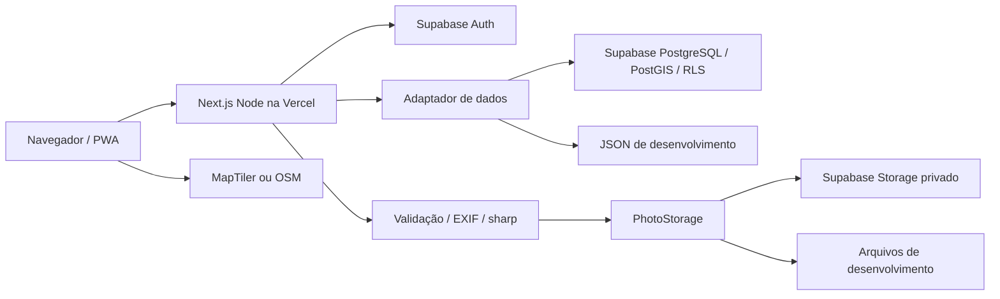

# Arquitetura

Um aplicativo Next.js App Router, TypeScript, Tailwind e MapLibre. Route Handlers Node.js validam entradas, sessão e autorização; adaptadores separam dados e Storage. Node 22.12+; versões fixadas no lockfile.

src/lib/server/storage.ts define PhotoStorage com put/read/remove e implementações Supabase e local. Trocar um provedor futuro, inclusive R2, não exige alterar o processamento nem a autorização. Supabase é o provedor atual; SDK AWS e credenciais R2 foram removidos.

Mapa: consultas por viewport, máximo 500 árvores, clustering no cliente, listas/galeria paginadas. Proximidade pública usa raio 10 m; índice geography GiST e índice geometry GiST para viewport. Sem chave MapTiler usa OSM com atribuição; tiles não são baixados para uso offline.

Fotos: 4 MiB, 40 MP, JPEG/PNG/WebP com MIME/extensão/decoder concordantes. Rotação EXIF; principal até 1800 px WebP qualidade 88; thumb 480 px qualidade 82. Sem ampliação. Originais não são armazenados; hash SHA-256 do original e EXIF relevante privado. Isso preserva boa qualidade visual para pesquisa futura, sem prometer equivalência ao original ou dataset científico validado.

Caminhos observacoes/{observacao_id}/web.webp e thumb.webp, upload sem overwrite. Chaves UUID legadas do modo local permanecem legíveis. Não há original.ext. Coordenadas/data EXIF são indícios revisáveis; data/local declarados e corrigidos definem o registro.

O bucket fotos é privado. Público e usuários autenticados não acessam objetos diretamente, mesmo aprovados: /api/media verifica aprovação ou admin antes de download com secret no servidor. Sem URLs públicas ou signed URLs persistentes. Cache público de aprovadas 300 s; mídia administrativa no-store e Vary: Cookie. Uma retirada de aprovação pode levar até 300 s para desaparecer do cache público já emitido.

A transação SQL cria árvore/observação/foto/metadata; aprovação é bloqueada por linha e auditada. Storage e PostgreSQL não compartilham transação: falha do banco tenta remover os dois objetos. Limpeza malsucedida emite aviso genérico, sem segredos; reconciliação de órfãos pode ser necessária. Não existe job de reconciliação automática.

DATA_BACKEND=supabase é o padrão. Falta de credenciais ou provedor desconhecido falha explicitamente. Local só quando selecionado em desenvolvimento/testes; JSON com fila e rename atômico, um processo. Produção bloqueia local.

PWA instala e oferece fallback offline; não promete envio ou mapa offline. Vercel executa APIs e sharp em Node; não é export estático. DATABASE_URL é uma ferramenta local de migração, não conexão do runtime web.
